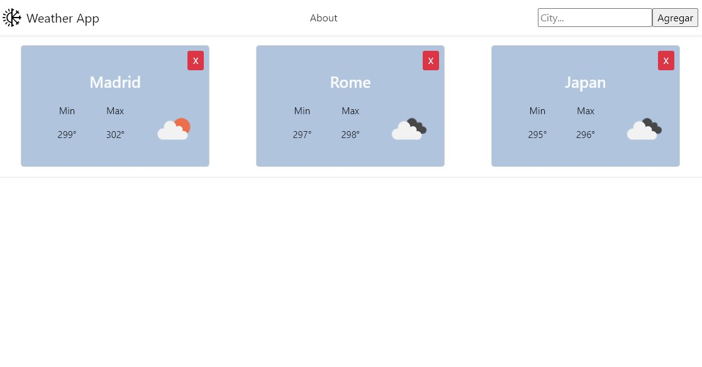
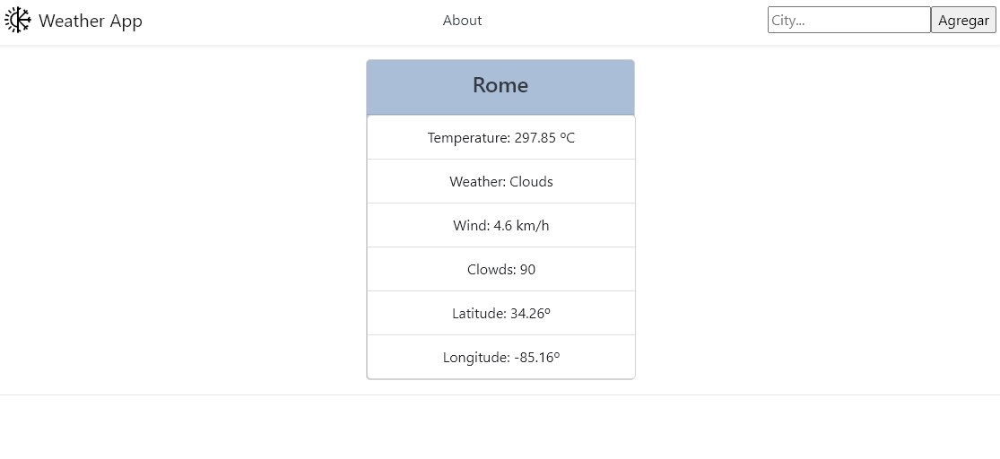

## Weather App

To run this project

From the root folder you should  be able to run the commands:

npm install : installs all the dependencies needed

npm start : Runs the app from your local host, so you can use it from your browser at http://localhost:3000

Some screenshots of the app running:

Through the search bar you can search for any city, the application is connected to the openweathermap.com API

By clicking on the name it is possible to see the details of the city.
